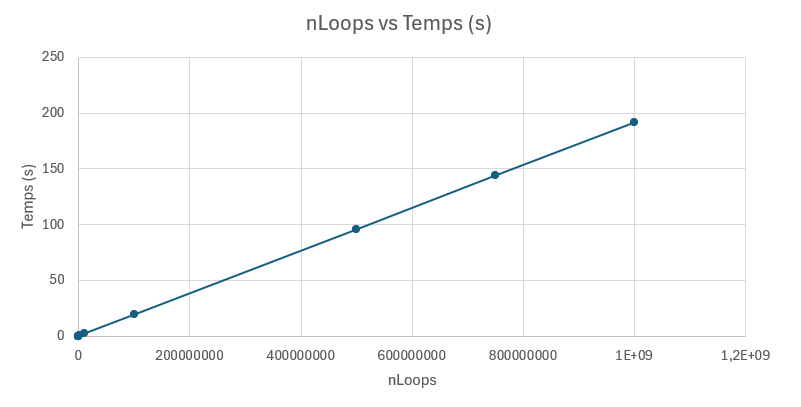

# CSC_5RO05_TA - GALLEGO Natalia

## TD1

### Gestion simplifiée du temps Posix

Compilez les fichiers sources :
```sh
arm-linux-g++ -Wall -Wextra -Wno-psabi td1a.cpp timespec.cpp -o tp1a
```
Sortie :
```sh
Timespec en millisecondes: 2500 ms
Millisecondes à Timespec: 2 s, 500000000 nsec
Temps actuelle: 534203 s, 322701373 nsec
Négatif de 2 s, 500000000 nsec est: -3 s, 500000000 nsec
Somme de 2 s, 500000000 nsec y 1 s, 700000000 nsec: 4 s, 200000000 nsec
Reste de 2 s, 500000000 nsec y 1 s, 700000000 nsec: 0 s, 800000000 nsec
En attente 1 secondes(s)...
Somme (t1 + t2): 8 s, 700000000 nsec
Reste (t1 - t2): 1 s, 700000000 nsec
Negaf de t1: - -6 s, 800000000 nsec
t1 += t2: 8 s, 700000000 nsec
t1 -= t2: 5 s, 200000000 nsec
t1 nest pas égal à t2
t1 est différent de t2
t1 est supérieur à t2
```


### Classe Chrono

Compilez les fichiers sources :
```sh
arm-linux-g++ -Wall -Wextra -Wno-psabi td1b.cpp Chrono.cpp timespec.cpp -o tp1b
```
Sortie :
```sh
Démarrage du chronomètre...
Temps écoulé après 2 secondes : 2000.79 ms
Chronomètre arrêté.
Temps écoulé après arrêt : 2001.18 ms
```

## TD2

### Timers avec callback
Compilez les fichiers sources :
```sh
arm-linux-g++ -Wall -Wextra -Wno-psabi td2a.cpp Chrono.cpp timespec.cpp -o tp2a
```
Sortie :
```sh
Tick 1
Tick 2
Tick 3
Tick 4
Tick 5
Tick 6
Tick 7
Tick 8
Tick 9
Tick 10
Tick 11
Tick 12
Tick 13
Tick 14
Tick 15
```


### Classe Timer
**‍Pour chaque élément de classe Timer, expliquez pourquoi il est public, privé ou protégé.**
1. -timer_t id (privée) : Il est marqué comme privé car il s'agit d'un détail d'implémentation interne à la classe. Seules les méthodes de la classe Timer doivent pouvoir y accéder directement pour éviter toute manipulation incorrecte depuis l'extérieur.

2. +Timer() (public) : Le constructeur est public pour permettre la création d'instances de la classe (ou de ses classes dérivées). Il initialise le timer Posix.

3. +~Timer() (public) : Le destructeur est public pour garantir que les ressources (comme le timer Posix) soient libérées correctement lorsque l'objet est détruit, même depuis un contexte externe.

4. +start(duration: timespec, isPeriodic: bool) & +start_ms(duration_ms: double, isPeriodic: bool) (public): Ces méthodes sont publiques car elles constituent l'interface principale pour démarrer le timer, que ce soit avec une durée en timespec ou en millisecondes. Les utilisateurs de la classe doivent pouvoir les appeler.

5. +stop() (public): Publique pour permettre l'arrêt du timer depuis l'extérieur de la classe.

6. #callback() (protégée) : Cette méthode est déclarée virtuelle pure (abstracte) et protégée car elle doit être implémentée par les classes dérivées, mais n'a pas d'implémentation par défaut dans Timer. Elle n'est pas destinée à être appelée directement par les utilisateurs de la classe, mais uniquement par la classe elle-même (via call_callback) ou ses dérivées. Cela permet de garantir que le callback est invoqué uniquement dans le bon contexte (par exemple, lors de l'expiration du timer).

7. -call_callback(int, siginfo_t*, void*) (privée) Cette méthode est statique pour respecter la signature C exigée par l'API Posix. Elle agit comme un pont entre le handler C et la méthode d'instance callback(). Les utilisateurs n'ont pas besoin d'y accéder directement ; elle est appelée uniquement par le système lors de l'expiration du timer.

Compilez les fichiers sources :
```sh
arm-linux-g++ -Wall -Wextra -Wno-psabi td2b.cpp Timer.cpp Chrono.cpp timespec.cpp CountDown.cpp -o tp2b
```
Sortie :
```sh
10
9
8
7
6
5
4
3
2
1
0
```

### Fonction simple consommant du CPU
‍**Justifiez quelle méthodes de Looper peuvent être déclarée const**
1. double getSample() const : Cette méthode renvoie simplement la valeur actuelle de iLoop sans modifier aucun membre de la classe. 
2. double stopLoop() : Pas const -> Cette méthode modifie l'attribut doStop (en le passant à true), donc elle ne peut pas être const.
3. double runLoop(double nLoops) : Pas const -> Cette méthode modifie à la fois iLoop (incrémentation) et doStop (réinitialisation), donc elle ne peut pas être const.

**Comment doit-on qualifier les variables doStop et iLoop si on veut être certain que la boucle d’incrémentation s’exécutera comme attendu?**

Pour garantir que la boucle d'incrémentation dans Looper::runLoop() s'exécute comme attendu sans optimisations indésirables du compilateur et avec une synchronisation thread-safe (si le code est utilisé en contexte multithread), les variables doStop et iLoop doivent être qualifiées comme suit :

1. std::atomic<bool> doStop;
    - Atomicité : garantit que les opérations de lecture/écriture sur doStop sont indivisibles (évite les corruptions de données en multithread).
    -  Visibilité : Les modifications de doStop sont immédiatement visibles par tous les threads (pas de caching local).
    -  Évite les optimisations agressives : Le compilateur ne supprimera pas les accès à doStop (contrairement à un bool standard).

2. std::atomic<double> iLoop;
   - Atomicité : Nécessaire si iLoop est accédé/modifié par plusieurs threads.
   -  Précision :assure des opérations thread-safe sur un flottant.

Compilez les fichiers sources :
```sh
arm-linux-g++ -Wall -Wextra Looper.cpp td2c.cpp Chrono.cpp  timespec.cpp -o tp2c
```
Sortie :
```sh
Début des tests de performance...
----------------------------------------
     nLoops | Valeur finale | Temps dexécution
----------------------------------------
nLoops:          100 | Valeur finale:          100 | Temps: 0.000023 s
nLoops:         1000 | Valeur finale:  1000.000000 | Temps: 0.000200 s
nLoops:        10000 | Valeur finale: 10000.000000 | Temps: 0.001927 s
nLoops:       100000 | Valeur finale: 100000.000000 | Temps: 0.019218 s
nLoops:      1000000 | Valeur finale: 1000000.000000 | Temps: 0.192018 s
nLoops:     10000000 | Valeur finale: 10000000.000000 | Temps: 1.919058 s
nLoops:    100000000 | Valeur finale: 100000000.000000 | Temps: 19.188925 s
nLoops:    500000000 | Valeur finale: 500000000.000000 | Temps: 95.944185 s
nLoops:    750000000 | Valeur finale: 750000000.000000 | Temps: 143.916219 s
nLoops:   1000000000 | Valeur finale: 1000000000.000000 | Temps: 191.888351 s
----------------------------------------
Tests terminés.
```



### Échantillonage du temps d’exécution d’une fonction

### Classe consommatrice de CPU durant un temps donné


